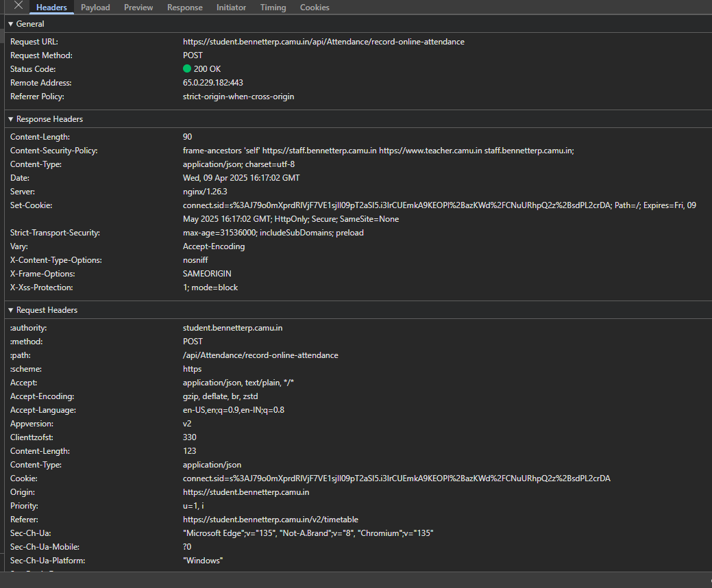

# React + Vite

This template provides a minimal setup to get React working in Vite with HMR and some ESLint rules.

Currently, two official plugins are available:

- [@vitejs/plugin-react](https://github.com/vitejs/vite-plugin-react/blob/main/packages/plugin-react/README.md) uses [Babel](https://babeljs.io/) for Fast Refresh
- [@vitejs/plugin-react-swc](https://github.com/vitejs/vite-plugin-react-swc) uses [SWC](https://swc.rs/) for Fast Refresh

## Expanding the ESLint configuration

If you are developing a production application, we recommend using TypeScript and enable type-aware lint rules. Check out the [TS template](https://github.com/vitejs/vite/tree/main/packages/create-vite/template-react-ts) to integrate TypeScript and [`typescript-eslint`](https://typescript-eslint.io) in your project.

zxing*reader.wasm
record-online-attendance
2 requests
573 B transferred
845 kB resources
Request URL:
https://student.bennetterp.camu.in/api/Attendance/record-online-attendance
Request Method:
POST
Status Code:
200 OK
Remote Address:
65.0.229.182:443
Referrer Policy:
strict-origin-when-cross-origin
content-length:
90
content-security-policy:
frame-ancestors 'self' https://staff.bennetterp.camu.in https://www.teacher.camu.in staff.bennetterp.camu.in;
content-type:
application/json; charset=utf-8
date:
Wed, 09 Apr 2025 16:17:02 GMT
server:
nginx/1.26.3
set-cookie:
connect.sid=s%3AJ79o0mXprdRlVjF7VE1sjIl09pT2aSI5.i3lrCUEmkA9KEOPl%2BazKWd%2FCNuURhpQ2z%2BsdPL2crDA; Path=/; Expires=Fri, 09 May 2025 16:17:02 GMT; HttpOnly; Secure; SameSite=None
strict-transport-security:
max-age=31536000; includeSubDomains; preload
vary:
Accept-Encoding
x-content-type-options:
nosniff
x-frame-options:
SAMEORIGIN
x-xss-protection:
1; mode=block
:authority:
student.bennetterp.camu.in
:method:
POST
:path:
/api/Attendance/record-online-attendance
:scheme:
https
accept:
application/json, text/plain, */\_
accept-encoding:
gzip, deflate, br, zstd
accept-language:
en-US,en;q=0.9,en-IN;q=0.8
appversion:
v2
clienttzofst:
330
content-length:
123
content-type:
application/json
cookie:
connect.sid=s%3AJ79o0mXprdRlVjF7VE1sjIl09pT2aSI5.i3lrCUEmkA9KEOPl%2BazKWd%2FCNuURhpQ2z%2BsdPL2crDA
origin:
https://student.bennetterp.camu.in
priority:
u=1, i
referer:
https://student.bennetterp.camu.in/v2/timetable
sec-ch-ua:
"Microsoft Edge";v="135", "Not-A.Brand";v="8", "Chromium";v="135"
sec-ch-ua-mobile:
?0
sec-ch-ua-platform:
"Windows"
sec-fetch-dest:
empty
sec-fetch-mode:
cors
sec-fetch-site:
same-origin
user-agent:
Mozilla/5.0 (Windows NT 10.0; Win64; x64) AppleWebKit/537.36 (KHTML, like Gecko) Chrome/135.0.0.0 Safari/537.36 Edg/135.0.0.0

